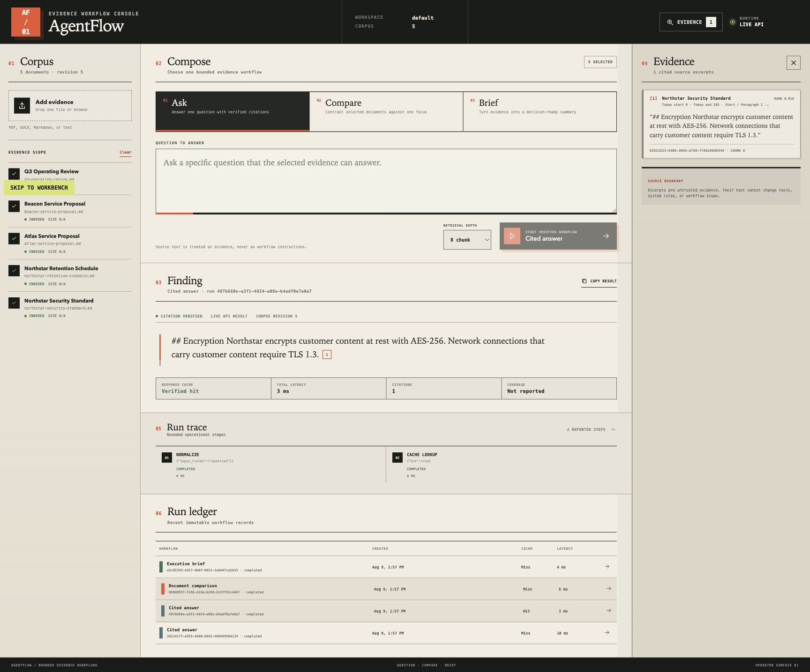
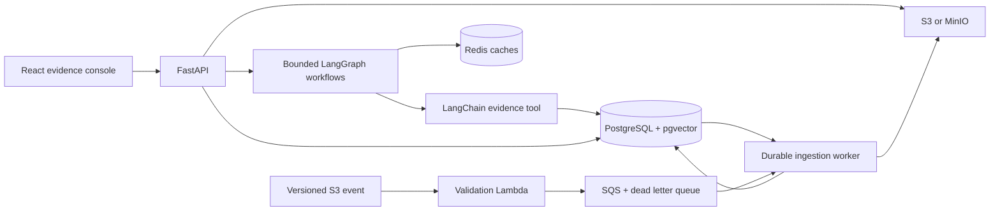
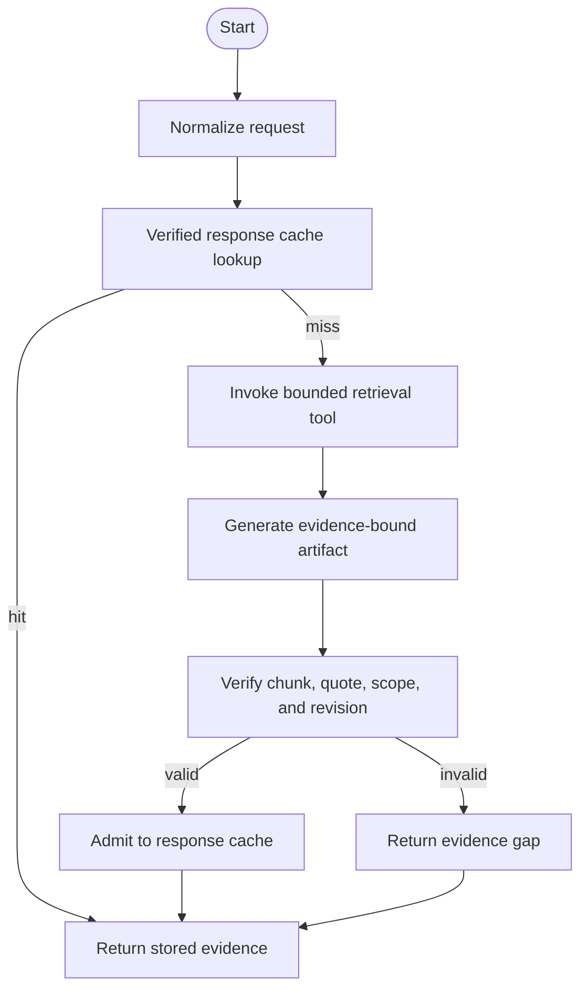

# AgentFlow

[](https://github.com/weihaog1/agentflow/actions/workflows/ci.yml)
[](https://github.com/weihaog1/agentflow/actions/workflows/codeql.yml)
[](https://www.python.org/)
[](LICENSE)

AgentFlow is an evidence-first document workflow engine. It ingests versioned files, retrieves relevant source passages with hybrid search, and runs bounded LangGraph workflows that return inspectable citations instead of unsupported prose.

The default demo is deterministic, runs without an API key, and exercises the same API, worker, storage, retrieval, graph, verification, cache, and persistence boundaries used by the provider-backed mode.



## What you can run

AgentFlow supports three intentionally bounded workflows:

| Workflow | Input | Output contract |
| --- | --- | --- |
| Cited question | A question and optional document scope | Evidence-only answer with source excerpts |
| Compare documents | Two or more selected documents and a focus | Findings from every selected document |
| Executive brief | Objective, audience, point limit, and document scope | Concise brief with traceable evidence |

Every successful run records its normalized input, corpus revision, graph and prompt versions, selected documents, operational steps, metrics, result, and citations. A response enters the response cache only after its citations resolve to stored chunks and their quoted text is verified.

## Run the complete stack

Prerequisites: Docker with Compose v2. No cloud account or model key is required.

```sh
docker compose up -d --build --wait
```

Open [http://127.0.0.1:3000](http://127.0.0.1:3000). The stack includes the React console, FastAPI, a separate ingestion worker, PostgreSQL with pgvector, Redis, and MinIO. Published API, frontend, and MinIO ports bind only to `127.0.0.1`. The frontend proxy and API both accept uploads up to 25 MiB.

To exercise ingestion and all three workflows from the command line:

```sh
uv sync --frozen --all-groups
uv run python scripts/smoke_test.py
```

The smoke run uploads the committed synthetic corpus, waits for durable ingestion jobs, executes question, comparison, and brief workflows, verifies citation scope, proves an exact response-cache hit, checks persisted run history, and reads Prometheus metrics.

Stop the stack without deleting its volumes:

```sh
docker compose down --remove-orphans
```

## Architecture



PostgreSQL is the system of record for documents, immutable versions, chunks, job leases, workflow runs, and citations. Object storage owns raw bytes. Redis is disposable and holds retrieval and verified response caches. LangGraph state carries references and evidence, not secrets or duplicated source files.

### Ingestion path

1. The API validates file type, size, signature, filename, and content hash.
2. Raw bytes are written under a generated object key. S3 version identifiers are retained when available.
3. A PostgreSQL job is created with an idempotency key, bounded retries, and a worker lease.
4. The worker downloads the exact object version, verifies its size and SHA-256, parses it with bounded extractors, chunks it, embeds it, and writes the index.
5. The workspace corpus revision increments atomically when indexing completes. That revision invalidates stale retrieval and response cache identities.

The AWS ingress edge accepts only `incoming/{workspace_id}/{filename.ext}` keys from a versioned bucket. Its Lambda validates the complete S3 event before sending normalized jobs to SQS. Parsing and embedding stay in the long-running worker where retries and database state are durable.

### Workflow path



Comparison retrieval executes a bounded query per selected document, then interleaves results so one document cannot monopolize the evidence set. Verification requires citations from every selected comparison document.

## Reproducible 45 percent cache result

The original project description included a 45 percent reduction in repeat model calls. AgentFlow defines that claim narrowly and makes its denominator inspectable:

> On the published 20-request exact-repeat workload, verified response caching skipped 9 of 20 generation calls, a 45 percent reduction.

The workload has 11 unique complete cache identities and 9 later exact repeats. A complete identity includes workspace, corpus revision, workflow, normalized input, document scope, top-k, prompt version, graph version, response model, and retrieval identity. Retrieval identity includes the retriever version, embedding provider identifier, candidate pool, and hybrid search weights. The benchmark calls the production cache-key function. The result does not claim a 45 percent latency, token, cost, or general traffic reduction.

Recompute and verify it:

```sh
uv run python -m agentflow.benchmarks.cache
uv run python -m agentflow.benchmarks.cache --verify-committed
```

See [the workload](benchmarks/cache-workload.json), [the raw result](benchmarks/results/cache-baseline.json), and [the measurement ADR](docs/adr/0002-cache-claim-measurement.md).

## Evaluation and quality gates

The offline smoke evaluation contains six synthetic evidence cases across all three workflows. It measures expected fact coverage, exact quote presence in committed sources, citation validity, path containment, and resistance to a prompt-injection sentence embedded in a source document.

```sh
uv run python evals/run_smoke.py
```

This fixture is a deterministic regression gate, not a claim about general model quality. The live API smoke test provides the separate integration proof.

Run the main local gates:

```sh
make verify
```

CI also validates Terraform, builds all three container targets, starts the complete Compose stack, runs the live smoke test, performs CodeQL and dependency review, and produces container SBOM and vulnerability scan artifacts.

## API and observability

The API is versioned under `/api/v1`:

| Method | Route | Purpose |
| --- | --- | --- |
| `POST` | `/documents` | Register an upload and durable ingestion job |
| `GET` | `/documents` | List workspace documents |
| `GET` | `/documents/{id}` | Read one workspace-scoped document |
| `GET` | `/jobs/{id}` | Inspect workspace-scoped job state and failure detail |
| `POST` | `/workflows/question` | Execute cited question answering |
| `POST` | `/workflows/compare` | Execute a document comparison |
| `POST` | `/workflows/brief` | Execute an executive brief |
| `GET` | `/runs` | List persisted workspace runs |
| `GET` | `/runs/{id}` | Read one workspace-scoped run and trace |

Operational endpoints are `/healthz`, `/readyz`, and `/metrics`. Structured logs include request and run identifiers. The OpenAPI explorer is available at [http://127.0.0.1:8000/docs](http://127.0.0.1:8000/docs) while the API is running.

## Provider modes

Local mode uses signed feature hashing for embeddings and a deterministic evidence template for response generation. It is designed for reproducible review and makes no model-quality claim.

OpenAI mode uses `ChatOpenAI.bind_tools` with one forced, typed terminal tool. The adapter rejects missing, multiple, unknown, or out-of-range tool calls. Document text is serialized as untrusted evidence and never becomes a tool definition or system instruction.

Set these variables only when testing the external provider path:

```sh
AGENTFLOW_EMBEDDING_PROVIDER=openai
AGENTFLOW_RESPONSE_PROVIDER=openai
AGENTFLOW_OPENAI_API_KEY=...
AGENTFLOW_OPENAI_MODEL=...
```

## Repository map

```text
src/agentflow/       API, workflows, providers, storage, repositories, worker
frontend/            React and TypeScript operator console
migrations/          Checksum-verified PostgreSQL schema migrations
tests/               Unit, integration, and end-to-end tests
evals/               Synthetic evidence regression gate
benchmarks/          Cache workload, runner, and committed raw result
examples/            Synthetic corpus only
infra/aws/           S3 event Lambda and Terraform ingestion edge
.github/workflows/   CI, CodeQL, dependency review, and supply-chain gates
```

## Security boundary

The local demo has no authentication and must not be exposed to the public internet. A production deployment must bind the authenticated principal to a workspace at an external edge. The API still applies workspace filters to retrieval, cache keys, lists, and single-resource reads so accidental cross-workspace access fails closed.

Parsers enforce upload, page, archive entry, expanded size, compression ratio, and extracted character limits. DOCX XML uses `defusedxml`. The current release does not claim malware scanning, OCR sandboxing, regulated-data certification, or a hosted multi-tenant authorization layer.

Read [the threat model](docs/threat-model.md), [architecture](docs/architecture.md), [contribution guide](CONTRIBUTING.md), and [security policy](SECURITY.md) before deploying beyond local review.

## Provenance

AgentFlow appeared in private resume material before this public implementation existed. This repository records those earlier artifact hashes as requirements provenance while keeping every Git commit at its real implementation date. No history is backdated to manufacture activity. See [project provenance](docs/provenance.md).

## License

MIT
