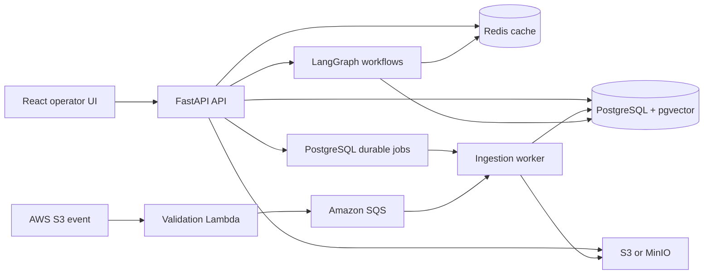
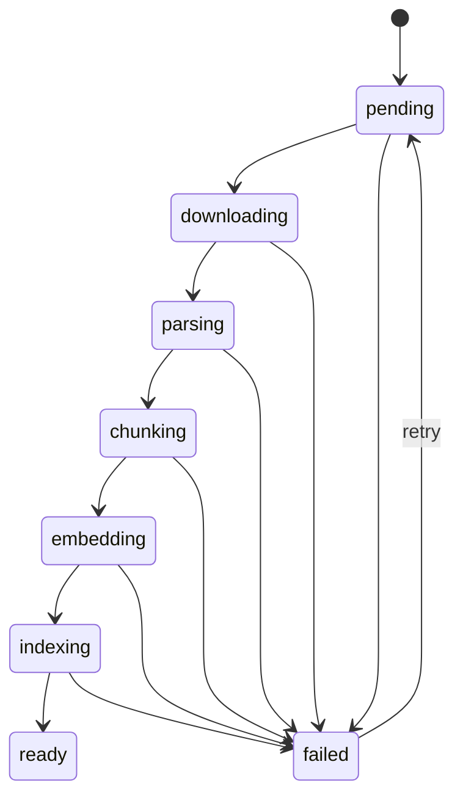
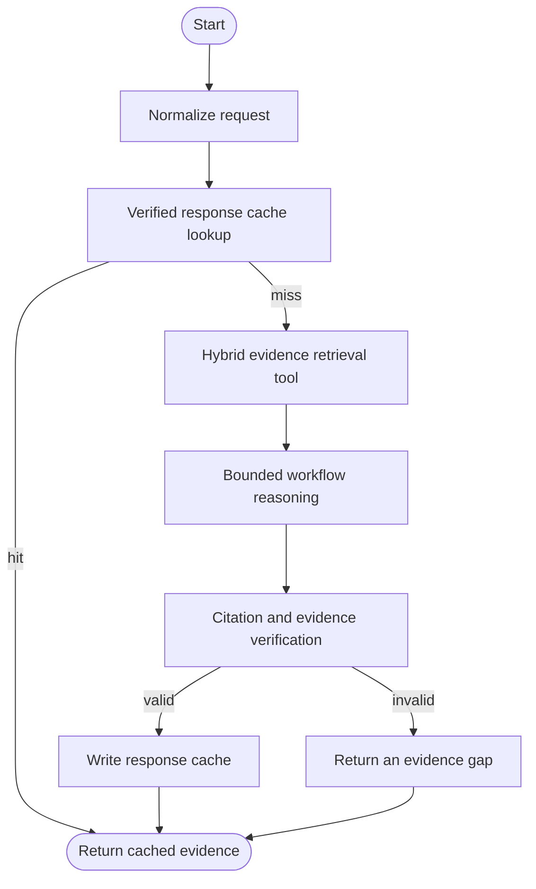

# Architecture

AgentFlow is an evidence-first document workflow engine. It ingests versioned documents, retrieves evidence with hybrid search, and executes bounded LangGraph workflows that always return inspectable citations.

## Product boundary

The first release supports exactly three workflows:

1. Cited question answering
2. Document comparison
3. Executive brief generation

Authentication providers, web search, browser agents, multi-agent planning, Kubernetes, Kafka, billing, and general-purpose autonomy are intentionally outside the first release.

## System view

Local development uses MinIO and PostgreSQL jobs. AWS deployment uses S3, a validation Lambda, SQS, and the same worker business logic.

## Data ownership

| Component | Owns | Must not own |
| --- | --- | --- |
| PostgreSQL | Documents, versions, chunks, jobs, runs, citations | Raw file bytes |
| Object storage | Raw uploaded files | Search indexes, workflow state |
| Redis | Retrieval cache, verified response cache, rate limits | Business records, job truth |
| LangGraph state | Run identifiers, artifact references, evidence, verification, metrics | Secrets, hidden reasoning, full duplicate documents |

## Ingestion state machine

Each transition is persisted. A worker lease prevents duplicate active work, while idempotency keys and content hashes make retries safe.

## Workflow graph

The graph has visible, defensible nodes. It does not model decorative agent roles.

## Cache correctness

Retrieval and response caches are separate.

Retrieval cache key inputs:

- Workspace identifier
- Corpus revision
- Normalized query
- Document scope and top-k
- Retriever version, embedding provider, candidate pool, and ranking weights

Response cache key inputs:

- Workspace identifier
- Corpus revision
- Workflow type
- Normalized input
- Document scope and top-k
- Prompt version
- Graph version
- Response model identifier
- Retriever version, embedding provider, candidate pool, and ranking weights

Only successful, citation-backed, verified responses are cached. A document change increments the corpus revision and invalidates both cache layers without scanning keys.

## Reliability and security

- Uploads have size, extension, MIME, and SHA-256 checks.
- File names are normalized and never used as storage paths.
- Document text is untrusted content and cannot define tools or system instructions.
- Jobs use bounded retries with an explicit terminal failure state.
- Logs carry request, run, document, and workflow identifiers at their relevant boundaries.
- Metrics expose stage latency, cache outcomes, token counts, citation counts, verification, and failures.
- Secrets are read from the environment and are never returned by APIs.

## Acceptance criteria

- A fresh clone starts locally with one documented command.
- A reviewer can upload the synthetic corpus, observe ingestion, run all three workflows, and inspect citations.
- The no-key demo uses deterministic local providers. A provider key enables a real tool-calling model without changing workflow code.
- Unit, integration, and end-to-end tests cover happy paths and failures.
- CI runs lint, typing, tests, evaluation smoke, benchmark verification, container builds, dependency review, CodeQL, SBOM generation, and vulnerability scanning.
- The cache claim is scoped to a published workload and reproduced from committed inputs.
