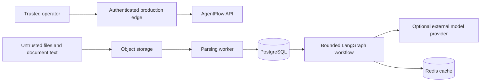

# Threat model

This document covers the first public release. It assumes a single trusted operator behind an authenticated production edge. The local demo intentionally has no authentication and must not be exposed directly to the internet.

## Assets

- Uploaded source files
- Extracted text and embeddings
- Workflow inputs, answers, and citations
- Provider credentials and cloud credentials
- Workspace and corpus isolation
- Integrity of benchmark and evaluation artifacts

## Trust boundaries

Uploaded bytes and all extracted text remain untrusted after parsing. A sentence inside a document never becomes a system instruction, tool definition, credential, or authorization decision.

## Threats and controls

| Threat | Control in this release | Residual risk |
| --- | --- | --- |
| Prompt injection inside a document | Fixed system policy, bounded tools, no document-defined tool calls, citation verification, committed injection fixture | A real model can still follow adversarial text. Provider mode requires ongoing eval coverage. |
| Cross-workspace retrieval | Workspace identifier is part of repository filters and both cache identities | The public demo is single operator. Production needs authenticated workspace binding at the edge. |
| Stale or poisoned cache | Corpus revision, workflow, prompt, graph, provider, and normalized input are key material. Only verified responses are admitted. | Redis compromise can affect availability and cached output integrity. Use managed encryption and private networking. |
| Path traversal | Generated object keys, normalized display names, resolved-path checks, no direct user path access | Parser dependencies can contain separate vulnerabilities. |
| Zip or decompression bomb | File size, page, archive entry, and uncompressed byte limits | Limits reduce impact but do not replace process isolation for hostile public uploads. |
| Parser resource exhaustion | Bounded extraction sizes, worker isolation, timeouts, durable failure state | The local Compose worker has host-level resource access. Production should enforce task CPU and memory limits. |
| Duplicate event or retry | Content hashes, idempotency keys, durable job state, worker leases | An operator can intentionally upload equivalent content under distinct workspaces. |
| Secret disclosure | Environment-backed secrets, structured error mapping, no secret values in API responses or logs | External providers receive the evidence sent to them. Production policy must define allowed data classes. |
| Citation fabrication | Citations reference stored chunk identifiers and quotes are verified against retrieved evidence before caching | Citation presence is not proof that the answer fully represents the source. Evaluation tracks fact coverage separately. |
| Supply-chain compromise | Locked dependencies, dependency review, CodeQL, SBOM generation, container scanning, least-privilege workflow permissions | Automated scanners do not prove a dependency is safe. Lock updates still require review. |

## Out of scope for the local demo

- Malware scanning
- Sandboxed native OCR or office conversion
- Multi-tenant authentication and authorization
- Legal hold enforcement
- Customer-managed encryption keys
- Regulated data certification

These are deployment requirements, not features that the repository claims to provide.
